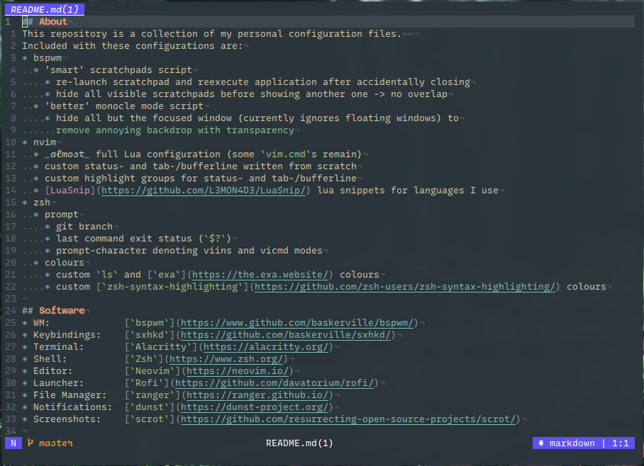

## About
Collection of personal configuration files.  

## Software
```
WM:            bspwm  (https://www.github.com/baskerville/bspwm/)
Keybindings:   sxhkd  (https://github.com/baskerville/sxhkd/)
Terminal:      kitty  (https://sw.kovidgoyal.net/kitty/)
Shell:         Zsh    (https://www.zsh.org/)
Editor:        Neovim (https://neovim.io/)
Launcher:      Rofi   (https://github.com/davatorium/rofi/)
Notifications: dunst  (https://dunst-project.org/)
Screenshots:   scrot  (https://github.com/resurrecting-open-source-projects/scrot/)
```

## Highlights
* bspwm
  * 'smart' scratchpads script
    * re-launch scratchpad and reexecute application when killed
    * hide all visible scratchpads before showing another one -> no overlap
  * 'better' monocle mode script
    * hide all but the focused window (currently ignores floating windows) to
      remove annoying backdrop with transparency
* Neovim
  * _almost_ 100% Lua configuration (some `vim.cmd`s still remain)
  * custom status- and tab-/bufferline written from scratch
  * toggleable terminal in separate split
* sxhkd
  * device-specific bindings that act differently depending on the machine
    that's used
    * device-specific files end in `.dt` and `.lt` respectively
      * semantically: *Desktop* and *Laptop*
    * the device type is read from `$HOME/Git/machine` (should contain either
    'DT' or 'LT') and exported as `$MACHINE` on login
    * e.g. `Alt + b` returns
      * mouse's battery percentage on a desktop
      * laptop's battery percentage on a laptop
* Zsh
  * prompt shows
    * current Git branch / tag / commit
    * last command's exit code when not zero
    * prompt-character denoting `viins` and `vicmd` modes
  * colours
    * custom `ls` and [`exa`](https://the.exa.website/) colours
      * note: colours require [`clsc`](https://gitlab.com/fell_/clsc)
    * custom [`zsh-syntax-highlighting`](https://github.com/zsh-users/zsh-syntax-highlighting/)
    colours

## Pictures
Zsh prompt:  
  

Neovim:  


## Keybindings
Keybindings needed to get up and running. Not exhaustive and subject to change.  
See [`sxhkd/`](source/.config/sxhkd/) for general keybindings. WM-specific
keybindings can be found in `source/.config/<WM>/sxhkdrc.<WM>`.

```
  Super + Enter:          spawn terminal
  Super + r:              spawn Rofi with custom run script
  Super + Shift + r:      spawn Rofi in window/drun mode
  Super + Shift + Tab:    cycle window | drun mode
  Super + o + b:          spawn browser

  Super + Shift + w:      kill node
  Super + Control + r:    reload window manager
  Super + Control + q:    kill window manager

  Super + f:              toggle node floating / tiled
  Super + Tab:            toggle 'monocle' layout

  Super + [0-x]:                      go to workspace [0-x]
  Super + [hjkl]:                     focus node in direction [hjkl]
  Super + Shift + [0-x]:              move node to workspace [0-x]
  Super + Shift + [hjkl]:             move node in direction [hjkl]

  Super + Control + n:                equalize nodes
  Super + Control + [hjkl]:           grow node *in* direction [hjkl]
  Super + Control + Shift + [hjkl]:   shrink node *from* direction [hjkl]

  Control + Alt + [hjkl]:   preselect in direction [hjkl]
  Control + Alt + [0-9]:    change preselect ratio
  Control + Alt + Escape:   cancel preselect

  Super + i + [ims]:        insert / move to / switch with receptacle

  Super + (Shift +) m:      take (full desktop) screenshot

  Alt + [bcdtu]: dunst notifications for system information
```

## Neovim Configuration Structure
Brief overview of the file structure for Neovim configuration:
* `init.lua` requires all relevant files inside the `lua` subdirectory
    * these are scattered throughout the config and may do slightly more than
      just requiring
* `lsp` contains any configuration regarding setting up and configuring servers
  * `lsp/servers` contains server-specific configuration; these files are
    required inside `lsp/setup.lua`
* `plugins` contains configuration pertaining to plugins; '.' in plugin names
  are replaced with '-'
  * files also include any keybindings for the plugin
  * the configuration for [`packer`](https://github.com/wbthomason/packer.nvim/)
    can also be found here
* `snippets` contains language specific snippets
* `utils` contains all other configuration, including
  * general settings
  * tab- and statusline
  * keymaps
