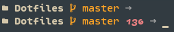

## About
Collection of personal configuration files.  

## Software
```
WM:            bspwm  (https://www.github.com/baskerville/bspwm/)
Keybindings:   sxhkd  (https://github.com/baskerville/sxhkd/)
Terminal:      kitty  (https://sw.kovidgoyal.net/kitty/)
Shell:         Zsh    (https://www.zsh.org/)
Editor:        Neovim (https://neovim.io/)
Launcher:      Rofi   (https://github.com/davatorium/rofi/)
Notifications: dunst  (https://dunst-project.org/)
Screenshots:   scrot  (https://github.com/resurrecting-open-source-projects/scrot/)
```

## Highlights
* bspwm
  * 'smart' scratchpads script
    * re-launch scratchpad and re-execute application when killed
    * hide all visible scratchpads before showing another one
  * 'better' monocle mode script
    * hide all but the focused window (currently ignores floating windows) to
      remove annoying backdrop with transparency
* Neovim
  * configuration can be found [here](https://gitlab.com/fell_/nvim)
* sxhkd
  * device-specific bindings that act differently depending on the machine
    that's used
    * device-specific files end in `.dt` and `.lt` respectively
      * semantically: _**D**esk**t**op_ and _**L**ap**t**op_
    * the device type is read from `$MACHINE` (should be either 'DT' or 'LT')
    * e.g. `Alt + b` returns
      * mouse's battery percentage on a desktop
      * laptop's battery percentage on a laptop
* Zsh
  * prompt shows
    * current git-`HEAD` as branch / tag / commit
    * last command's exit code when not zero
    * prompt-character denoting `viins` and `vicmd` modes
  * colours
    * custom `ls` and [`eza`](https://github.com/eza-community/) colours
      * note: colours require [`clsc`](https://gitlab.com/fell_/clsc/)
    * custom [`zsh-syntax-highlighting`](https://github.com/zsh-users/zsh-syntax-highlighting/)
    colours

## Pictures
Zsh prompt:  
  

## Keybindings
Keybindings needed to get up and running. Not exhaustive and subject to change.  
See [`sxhkd/`](source/.config/sxhkd/) for general keybindings. WM-specific
keybindings can be found in `source/.config/<WM>/sxhkdrc.<WM>`.  
Semicolons in keybindings, just like in sxhkd, indicate key-chords.

```
  Super   + Enter:          spawn terminal
  Super   + r:              spawn Rofi in combi-mode
  Super   + o; b:           spawn browser

  Super + Shift   + w:      kill node
  Super + Control + r:      reload window manager
  Super + Control + q:      kill window manager

  Super + f:                toggle node floating / tiled
  Super + Tab:              toggle 'monocle' layout

  Super + [0-x]:            go to workspace [0-x]
  Super + [hjkl]:           focus node in direction [hjkl]
  Super + Shift + [0-x]:    move node to workspace [0-x]
  Super + Shift + [hjkl]:   move node in direction [hjkl]

  Super + Control + n:                equalize nodes
  Super + Control + [hjkl]:           grow node *in* direction [hjkl]
  Super + Control + Shift + [hjkl]:   shrink node *from* direction [hjkl]

  Control + Alt + [hjkl]:   preselect in direction [hjkl]
  Control + Alt + [0-9]:    change preselect ratio
  Control + Alt + Escape:   cancel preselect

  Super + i; [ims]:         insert / move to / switch with receptacle

  Super + (Shift +) m:      take (full desktop) screenshot

  Alt + [1-x]:    launch scratchpad with index [1-x]
  Alt + [bcdtu]:  dunst notifications for system information
```
